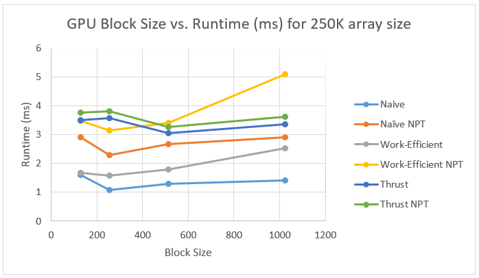
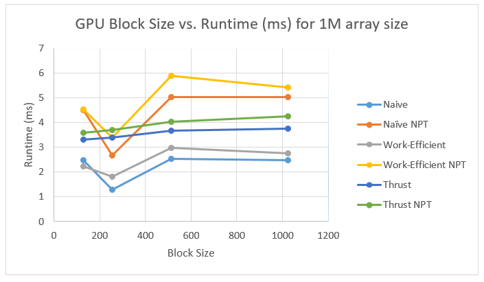

CUDA Stream Compaction
======================

**University of Pennsylvania, CIS 565: GPU Programming and Architecture, Project 2**

* Ziad Ben Hadj-Alouane
  * [LinkedIn](https://www.linkedin.com/in/ziadbha/), [personal website](https://www.seas.upenn.edu/~ziadb/)
* Tested on: Windows 10, i7-8750H @ 2.20GHz, 16GB, GTX 1060


# Project Goal
<p align="center">
  
</p>

In this project, I implemented 2 notable parallel algorithms: Scan (Prefix Sum) & Stream Compaction. The latter algorithm is widely used as a building block for other parallel algorithms. In fact, stream compaction is used in path tracing, a project I intend to implement soon.

# Features
## Scan
### Input
A stream of ints of predetermined length

### Output
A stream of ints `out` such that for `out[idx]`, we store the running sum of the previous elements. For *exclusive* scan, we exclude the element at `input[idx]`. Otherwise, we have an *inclusive* scan.

### GPU Implementation
#### Naive
<p align="center">
  
</p>

This algorithm is based on the scan algorithm presented by Hillis and Steele (1986). However, this algorithm performs **O(n log2 n)** addition operations. In contrast, the sequential scan performs **O(n)** adds. Therefore, the naive implementation is not work-efficient. 

#### Work-Efficient
This algorithm has 2 phases: an upsweep (reduction) phase, and a downsweep phase. Both of these phases are implemented as separate kernel functions in CUDA, with each outlined level designating a kernel call of the corresponding phase. We run upsweep on the entire array until we hit all **log(n)** levels, then we run downsweep on the output of upsweep. The result is an exclusive scan of the original input.

##### Upsweep
<p align="center">
  
</p>

##### Downsweep
<p align="center">
  
</p>

## Compact
<p align="center">
  
</p>

### Input
A stream of ints of predetermined length

### Output
A stream of ints equal to the input, but with all 0s removed

### GPU Implementation
Using scan as a building block, we can implement a parallel version of compact by going through some extra steps:
1. We obtain a boolean array version of the input array (`True` if `input[idx != 0]`, else `False`)
2. We Scan the boolean array
3. We use Scatter, an algorithm that fills an output array using the following condition: if `bool[idx] == 1` then `out[scan[idx]] = input[idx]`

For reference, I used Nvidia's [GPU Gems](https://developer.nvidia.com/gpugems/GPUGems3/gpugems3_ch39.html) to implement this algorithm.

# Performance Analysis, Q & A
### How does a rough optimization of the block sizes of each of your implementations affect GPU run time?
| Scan with array size 250K | Scan with array size 1M | 
| ------------- | ----------- |
|  |  |

In both cases, thrust seems to perform the worst (disregarding the NPT cases). This is either a timing issue given that thrust probably does some mallocs (which I did not include in my performance analysis), or simply because thrust has too much overhead and could perform better for even bigger array sizes. Naive performed better than Work-Efficient due to the lack of usage of shared memory. The overhead associated with global memory accesses for scatter and bools makes work-efficient less efficient in practice. In all cases, it seems that a block size of 256 yielded the best results, which makes sense since we have more blocks and we still fill in each warp completely. Larger block sizes mean less block count, which entail less SMs working.


### Runtime of different GPU Scan implementation & CPU Scan implementation (runtime vs. array size)?

<p align="center">
  
</p>

As the array size increases, the CPU implementations seem to linearly decrease in performance. The CPU NPT implementation ends up performing the worst for array sizes > 1M. However, when array sizes are relatively small (< 250K), the CPU implementaitons seem to perform the best. The GPU overhead is not worth it in these cases. 
For larger array sizes, Naive & Work-Efficient (power of two) perform really well compared to the thrust implementation, again probably because of timing issues. Overall, the NPT (non-power of two array sizes) implementations perform the worst as explained above (as warps aren't completely filled).

### Performance bottlenecks for each implementation? Is it memory I/O? Computation? Is it different for each implementation?
#### CPU
Memory & scheduling can be considered a bottleneck for the sequential CPU implementation. However, this is only apparent for really large array sizes since the CPU takes advantage of better caching for smaller array sizes.

#### Naive
Global memory access, general work-inefficiency of naive approach are an issue. Since we are not using shared memory, then the work-inefficiency is amplified in the naive approach.

#### Work-efficient
This implementation could improve dramatically if shared memory is used, since it inherently does less operations than the naive approach.

### Any test output?
#### Scan Tests (array size = 2 ^ 14)

```
    [   1   1   0   1   1   1   0   0   1   1   1   0   1 ...   1   0 ]
==== cpu scan, power-of-two ====
   elapsed time: 0.006029ms    (std::chrono Measured)
    [   0   1   2   2   3   4   5   5   5   6   7   8   8 ... 2026 2027 ]
==== cpu scan, non-power-of-two ====
   elapsed time: 0.012058ms    (std::chrono Measured)
    [   0   1   2   2   3   4   5   5   5   6   7   8   8 ... 2025 2025 ]
    passed
==== naive scan, power-of-two ====
   elapsed time: 0.858208ms    (CUDA Measured)
    passed
==== naive scan, non-power-of-two ====
   elapsed time: 1.39376ms    (CUDA Measured)
    passed
==== work-efficient scan, power-of-two ====
   elapsed time: 1.04755ms    (CUDA Measured)
    passed
==== work-efficient scan, non-power-of-two ====
   elapsed time: 2.08691ms    (CUDA Measured)
    passed
==== thrust scan, power-of-two ====
   elapsed time: 2.89587ms    (CUDA Measured)
    passed
==== thrust scan, non-power-of-two ====
   elapsed time: 2.91533ms    (CUDA Measured)
    passed
```

#### Stream Compaction Tests (array size = 2 ^ 14)

   ``` [   2   3   0   0   3   0   1   0   1   3   3   2   0 ...   3   0 ]
==== cpu compact without scan, power-of-two ====
   elapsed time: 0.022261ms    (std::chrono Measured)
    [   2   3   3   1   1   3   3   2   3   2   1   3   1 ...   3   3 ]
    passed
==== cpu compact without scan, non-power-of-two ====
   elapsed time: 0.032464ms    (std::chrono Measured)
    [   2   3   3   1   1   3   3   2   3   2   1   3   1 ...   2   3 ]
    passed
==== cpu compact with scan ====
   elapsed time: 0.050087ms    (std::chrono Measured)
    [   2   3   3   1   1   3   3   2   3   2   1   3   1 ...   3   3 ]
    passed
==== work-efficient compact, power-of-two ====
   elapsed time: 1.09165ms    (CUDA Measured)
    passed
==== work-efficient compact, non-power-of-two ====
   elapsed time: 1.05386ms    (CUDA Measured)
    passed ```
